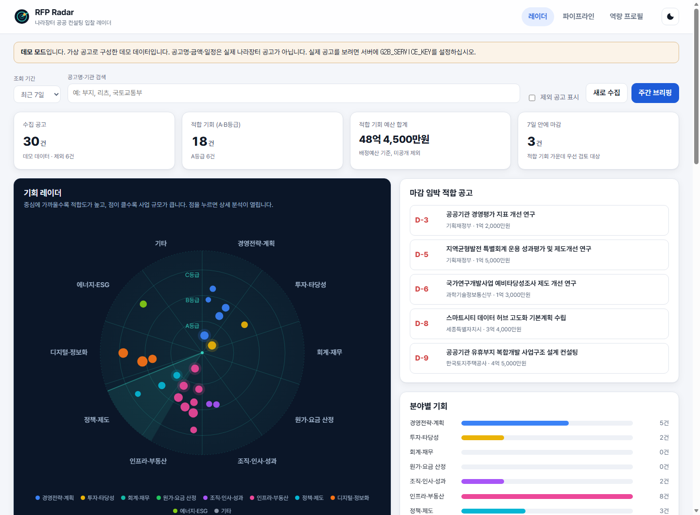
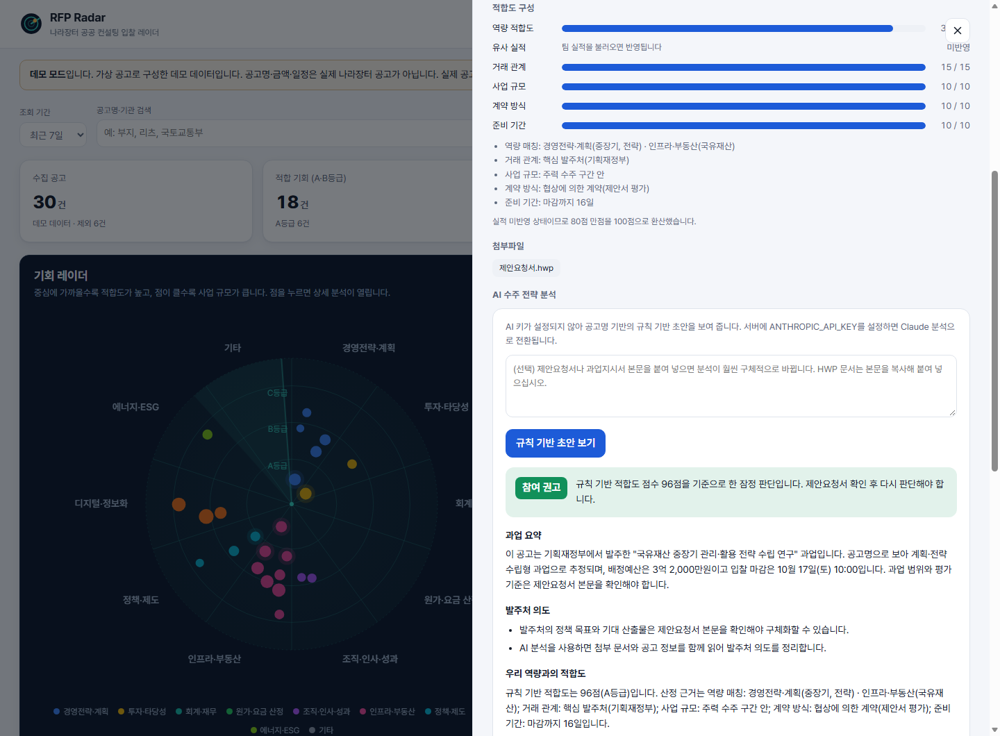
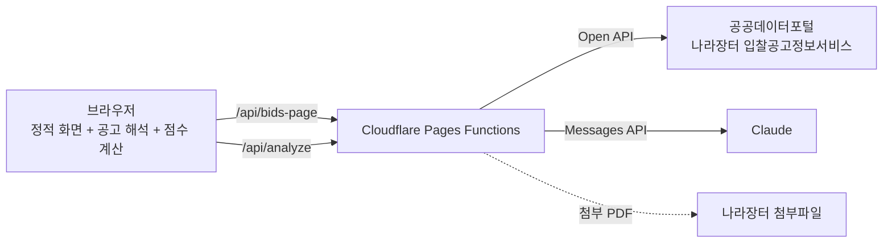

# RFP Radar

나라장터 용역 공고를 매일 수집해 공공 컨설팅 적합도를 점수로 매기고, 참여할 만한 공고에 대해서는 Claude가 입찰 참여 판단과 제안 착수 메모를 작성해 주는 입찰 레이더입니다.



## 해결하려는 문제

공공 컨설팅 조직은 제안 기회를 찾기 위해 나라장터를 거의 매일 확인합니다. 용역 공고는 하루에도 수백 건이 올라오지만, 그중 컨설팅 조직이 실제로 참여할 만한 공고는 일부에 불과합니다. 그래서 담당자는 공고명을 하나씩 읽으며 걸러 내고, 걸러 낸 공고마다 참여 여부를 논의하고, 참여가 정해지면 제안요청서를 처음부터 읽으며 제안 방향을 잡습니다.

이 과정에는 세 가지 비효율이 있습니다.

| 단계 | 현재 방식 | RFP Radar의 방식 |
|---|---|---|
| 기회 발굴 | 담당자가 공고명을 눈으로 선별 | 역량 프로필 기반 자동 점수화와 제외 필터 |
| 참여 판단 | 회의에서 감으로 판단 | 점수 구성 근거와 AI 참여 판단(GO, 조건부, 보류) |
| 제안 착수 | 제안요청서를 읽고 방향 수립에 며칠 소요 | 발주처 의도, 수주 전략, 목차 초안을 몇 분 안에 초안으로 생성 |

## 주요 기능

- **기회 레이더**: 공고를 분야별 부채꼴에 배치하고, 적합도가 높을수록 중심에 가깝게 표시합니다. 점의 크기는 사업 규모를 나타냅니다.
- **적합도 점수(0~100점)**: 역량 적합도, 유사 실적, 거래 관계, 사업 규모, 계약 방식, 준비 기간의 여섯 항목으로 점수를 계산하고 근거를 함께 보여 줍니다.
- **팀 수행 실적 반영**: 과거 수행 실적 엑셀을 불러오면 공고마다 가장 비슷한 과거 과업 3건을 찾아 보여 주고, 반복 거래처·주력 수주 금액 구간·분야별 가중치를 실적에서 자동으로 계산합니다.
- **AI 수주 전략 분석**: Claude가 공고 정보와 (선택한) 제안요청서 본문 또는 첨부 PDF를 읽고 과업 요약, 발주처 의도, 수주 전략, 제안서 목차 초안, 필요 전문가, 리스크, 발주처 질의 사항, 참여 판단을 작성합니다.
- **제안 파이프라인**: 관심, 검토 중, 제안 준비, 제출 완료, 수주, 미수주·포기의 여섯 단계 칸반 보드로 공고를 관리하고 CSV로 내보낼 수 있습니다.
- **주간 브리핑**: 적합 기회와 마감 임박 공고를 팀 메신저나 메일에 붙여 넣을 수 있는 문장으로 정리합니다.
- **역량 프로필 편집**: 분야별 키워드와 가중치(핵심, 주력, 인접), 제외 키워드, 핵심 발주처, 선호 사업 규모를 화면에서 바꾸면 점수가 즉시 다시 계산됩니다.



## 동작 구조



- 화면은 빌드 과정이 없는 HTML, CSS, JavaScript로 만들었고 Cloudflare Pages에 그대로 올라갑니다.
- 공공데이터포털 인증키와 Anthropic API 키는 서버 함수(Pages Functions)에만 보관하므로 브라우저로 전달되지 않습니다.
- 서버 함수는 인증키만 붙여 나라장터 응답 원문을 그대로 전달하고, 수 MB에 이르는 응답의 해석은 브라우저가 맡습니다. 그래서 Cloudflare 무료 요금제의 요청당 CPU 한도(10ms) 안에서 동작합니다.
- 나라장터 조회 결과는 엣지 캐시에 15분간 저장해 공공데이터포털 개발계정의 일일 호출 한도를 아낍니다.
- 적합도 점수는 브라우저 안에서만 계산하며, 역량 프로필과 파이프라인 기록도 브라우저 저장소에만 남습니다.

## 적합도 점수 산정 방식

| 항목 | 배점 | 기준 |
|---|---|---|
| 역량 적합도 | 35 | 9개 분야 키워드 일치 수 × 분야 가중치(핵심·주력·인접), 다분야 일치와 컨설팅성 과업 신호 가산 |
| 유사 실적 | 20 | 팀 수행 실적과 공고명의 유사도(IDF 가중 코사인). 18% 미만 0점, 45% 이상 만점 |
| 거래 관계 | 15 | 발주처와의 과거 수행 건수. 10건 이상 15점, 3~9건 11점, 1~2건 6점 |
| 사업 규모 | 10 | 팀 실적의 최근 5년 계약금액 분포 기준. 주력 구간 10점, 경험 구간 6점 |
| 계약 방식 | 10 | 협상에 의한 계약(제안서 평가) 10점, 적격심사 4점 |
| 준비 기간 | 10 | 마감까지 14일 이상 10점에서 3일 이하 1점까지 단계별 차등 |

- 실적을 불러오지 않았으면 유사 실적(20점)을 뺀 80점 만점을 100점으로 환산합니다.
- 등급은 A(75점 이상, 우선 검토), B(65점 이상, 검토), C(50점 이상, 관찰), D(그 외)로 나눕니다.
- 조달청이 대신 발주한 공고는 공고기관(조달청)이 아니라 수요기관을 기준으로 거래 관계를 판단합니다.
- 청소, 구매, 안전진단처럼 컨설팅과 무관한 용역은 항상 제외합니다. 유지보수, 운송, 폐기물처럼 컨설팅 과업명에도 등장하는 단어는 "산정", "전략", "경제성" 같은 컨설팅성 신호가 없을 때만 제외합니다. 예를 들어 "철도차량 유지보수 수탁비용 산정기준 마련"은 제외하지 않습니다.
- 취소공고는 수집 단계에서 빼고, 기관과 공고명이 같은 재공고는 가장 최근 공고만 남깁니다.

## 팀 수행 실적 반영

역량 프로필 탭에서 실적 파일(엑셀·CSV)을 불러오면 평가 기준이 팀의 실제 수주 이력에 맞게 바뀝니다.

| 자동으로 계산하는 값 | 계산 방법 |
|---|---|
| 분야 가중치 | 분야별 실적 비중이 가장 큰 분야의 50% 이상이면 핵심, 20% 이상이면 주력, 그 밖은 인접 |
| 거래 관계 | 거래처별 수행 건수(법인 표기 정리, 회계법인·컨설팅사 명의는 제외) |
| 사업 규모 | 최근 5년 계약금액의 10%·40%·90% 지점과 최댓값 |
| 유사 실적 | 과거 과업명 전체로 만든 역색인에서 공고명과 가장 비슷한 과업 3건 |

- 필요한 열은 과업명(적요·사업명), 거래처(발주처), 등록월(계약일·연도), 계약금액이며, 머리글이 첫 줄이 아니어도 찾습니다.
- 실적 파일은 브라우저 안에서만 읽고 브라우저 저장소에만 보관합니다. 서버로 올리지 않으며, AI 분석을 요청할 때도 과거 과업명·거래처·건수는 "유사 실적 있음" 수준으로 가려서 보냅니다.
- 실적 파일은 조직 내부 자료이므로 이 저장소에 커밋하지 않도록 주의해야 합니다.

## 빠른 시작

### 1. 데모 모드로 바로 보기

API 키 없이도 가상 공고 30건으로 모든 화면을 확인할 수 있습니다.

```bash
cd public
python -m http.server 8788
# 브라우저에서 http://127.0.0.1:8788 접속
```

### 2. 실제 나라장터 데이터와 Claude 분석 연결

1. [공공데이터포털](https://www.data.go.kr/data/15129394/openapi.do)에서 "조달청_나라장터 입찰공고정보서비스"를 활용신청하고 일반 인증키를 받습니다.
2. [Anthropic Console](https://console.anthropic.com/)에서 API 키를 발급합니다. 이 키가 없으면 AI 분석 대신 규칙 기반 초안이 표시됩니다.
3. 아래 명령으로 로컬 서버를 실행합니다.

```bash
npm install
cp .dev.vars.example .dev.vars   # 인증키 입력
npm run dev                      # http://127.0.0.1:8788
npm test                         # 단위 테스트
```

## 배포 (Cloudflare Pages)

1. 이 저장소를 GitHub에 올린 뒤 Cloudflare 대시보드의 Workers & Pages에서 Pages 프로젝트를 만들고 저장소를 연결합니다.
2. 빌드 설정은 Framework preset을 None으로 두고, Build output directory를 `public`으로 지정합니다.
3. Settings의 Variables and Secrets에 아래 값을 Secret으로 등록합니다.

| 이름 | 필수 여부 | 설명 |
|---|---|---|
| `G2B_SERVICE_KEY` | 선택 | 공공데이터포털 일반 인증키, 없으면 데모 모드 |
| `ANTHROPIC_API_KEY` | 선택 | Claude API 키, 없으면 규칙 기반 초안 |
| `ACCESS_CODE` | 권장 | 공개 배포 시 AI 분석 호출에 요구할 접근 코드 |
| `ANTHROPIC_BASE_URL` | 선택 | Cloudflare AI Gateway 같은 프록시를 거칠 때만 설정 |

AI 분석은 호출할 때마다 비용이 발생하므로, 공개 주소로 배포할 때는 `ACCESS_CODE`를 반드시 설정하는 편이 안전합니다. 접근 코드는 화면의 역량 프로필 탭에서 입력합니다.

## AI 분석 설계

- 모델은 `claude-opus-5-5`를 쓰며, 응답은 JSON 스키마로 고정한 구조화 출력(structured outputs)으로 받아 화면에 그대로 배치합니다.
- 시스템 프롬프트는 공고와 첨부 자료에 없는 예산, 일정, 평가 배점을 지어내지 않도록 요구하고, 확인되지 않는 항목은 확인 방법과 함께 명시하도록 지시합니다.
- 첨부 PDF는 나라장터 도메인(`g2b.go.kr`)에서 받은 파일만 읽도록 제한해, 서버가 임의 주소를 대신 요청하는 일을 막습니다.
- 안전 분류기가 요청을 거절하는 경우를 대비해 서버 측 대체 모델(`fallbacks: "default"`)을 켜 두었습니다.

## 로드맵

- 사전규격 공개 단계에서 기회를 먼저 포착하는 조기 경보 기능을 추가하려고 합니다. 본공고가 게시되기 전에 준비를 시작할 수 있기 때문입니다.
- 나라장터 낙찰정보서비스를 연결해 발주처별 낙찰률과 경쟁사 수주 이력을 분석하려고 합니다.
- 제안 결과(수주·실패)를 파이프라인에 쌓아 항목별 배점을 학습하고, 규칙 점수를 실제 수주 확률에 가깝게 만들 계획입니다.
- 파이프라인을 팀 공용 데이터베이스로 옮기고, 새 A등급 공고가 게시되면 메신저로 알림을 보내는 기능을 계획하고 있습니다.
- HWP 형식 제안요청서의 본문을 자동 추출해 붙여 넣기 단계를 없애려고 합니다.

## 한계

- 적합도 점수는 공고명과 공고 정보만으로 계산하는 규칙 점수이므로, 과업 범위가 공고명에 드러나지 않는 공고는 점수가 낮게 나올 수 있습니다.
- AI 분석은 검토용 초안입니다. 입찰 참여 여부와 제안 내용은 반드시 제안요청서 원문을 확인한 뒤 결정해야 합니다.
- 공공데이터포털 Open API의 응답 필드와 호출 한도는 제공 기관 사정에 따라 바뀔 수 있습니다.

## 데이터 출처와 고지

공고 데이터는 조달청 나라장터 입찰공고정보서비스(공공데이터포털 Open API)에서 가져옵니다. 이 프로젝트는 개인 프로젝트이며 조달청이나 발주기관과 관련이 없습니다. `public/data/demo-bids.json`의 공고는 화면 시연을 위해 만든 가상 공고입니다.

## 라이선스

MIT
